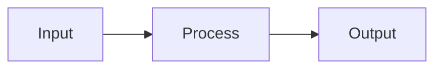

# Design

> Describe **how** to implement technically. Keep the 6 fixed sections.

## 1. Overview

[Brief summary of the feature, goal, and scope.]

## 2. Architecture

[High-level decisions: patterns, layers, integrations.]

- [Component or layer 1]
- [Component or layer 2]

## 3. Components

| Component | Responsibility |
|-----------|----------------|
| [Name]    | [What it does] |

## 4. Data Models

[Entities, relationships, and data flows. Use Mermaid when helpful.]

## 5. Error Handling

- [Error scenario 1] → [Expected response]
- [Error scenario 2] → [Expected response]

## 6. Testing

- [ ] Unit test: [EARS criterion it validates]
- [ ] Integration test: [end-to-end flow]
- [ ] Regression test: [edge case]
